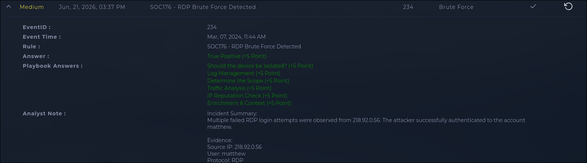

# INV-001: RDP Brute Force, Successful Login from External IP

| | |
|---|---|
| **Platform** | LetsDefend |
| **Category** | Brute Force |
| **Severity** | Medium |
| **Verdict** | True Positive |

## Executive Summary

A SIEM rule flagged repeated RDP login failures against host `Matthew` (172.16.17.148) from a single external IP, 218.92.0.56, cycling through usernames that don't exist on the box. Log review showed the failures were followed by a successful login as `matthew`. The attacker didn't just try, they got in. The source IP has a long brute force history on AbuseIPDB. Host isolated, account flagged for a credential reset.

## Alert Information

| Field | Value |
|-------|-------|
| Alert ID | SOC176 (Event ID 234) |
| Detection Rule | SOC176, RDP Brute Force Detected |
| Source IP | 218.92.0.56 |
| Destination IP / Asset | 172.16.17.148 (host: Matthew) |
| Alert Trigger Reason | Login failures from one source against multiple nonexistent accounts |

## Investigation

The pattern itself is the tell: one external IP, dozens of failed logins across usernames that don't exist on the host. That's brute forcing, not a typo. Checking the auth logs confirmed it escalated. After the failed attempts, 218.92.0.56 logged in successfully as `matthew`. That's what moved this from a noisy failed-login alert to a confirmed compromise.

Traffic analysis showed the firewall action on the RDP connection was Allowed, meaning RDP was open directly to the internet instead of sitting behind a VPN or jump host. That's the actual exposure that let the brute force work.

Ran a reputation check on 218.92.0.56 (CHINANET, Jiangsu, China). It's been reported 453,051 times across 963 sources on AbuseIPDB, mostly for SSH and RDP brute forcing. Its current confidence score has decayed toward 0 because of how AbuseIPDB ages out older reports, but the sheer report volume tells you this IP has been doing this for a long time.

Didn't check scope beyond this host during the investigation. Flagging that here instead of assuming it was covered.

## IOC Table

| Type | Value | Description |
|------|-------|--------------|
| IP | 218.92.0.56 | Attacker source |
| IP | 172.16.17.148 | Targeted host (Matthew) |
| Username | matthew | Compromised account |

## Threat Intelligence

| Indicator | Checked Via | Result |
|-----------|-------------|--------|
| 218.92.0.56 | AbuseIPDB | 453K+ reports, mostly SSH/RDP brute force; CHINANET Jiangsu |

## MITRE ATT&CK Mapping

| Tactic | Technique | Evidence |
|--------|-----------|----------|
| Initial Access | T1133, External Remote Services | RDP reachable directly from the internet |
| Credential Access | T1110.001, Brute Force: Password Guessing | Repeated logins across multiple usernames |
| Initial Access | T1078, Valid Accounts | Successful login as `matthew` after brute force |

## Impact & Verdict

Single internet-facing host compromised through brute forced RDP credentials. One account, one host, moderate impact. Scope beyond that host was never checked, so I can't say with full confidence nothing else was touched. Verdict is True Positive, high confidence. The failure pattern plus a successful login from an IP with this much brute force history doesn't leave much room for another explanation.

## Recommended Response

- **Containment:** Isolate host 172.16.17.148
- **Eradication:** Block 218.92.0.56 at the firewall
- **Recovery:** Force password reset for `matthew`; review the account for post-auth activity
- **Prevention:** Remove direct internet exposure of RDP (VPN/jump host only); enable account lockout and MFA on RDP-accessible accounts

## Lessons Learned

The real issue isn't just this one attacker, it's that RDP was open to the internet at all. Also worth flagging for process: scope check got skipped here. A successful login with no scope check after it means the investigation wasn't actually finished.

## Evidence

### Alert Overview

*Figure 1: LetsDefend alert overview showing the alert details, completed playbook, and final True Positive verdict.*
