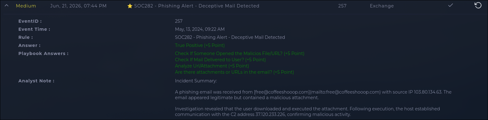

# INV-002: Phishing Email, Malicious Attachment Executed with C2 Callback

| | |
|---|---|
| **Platform** | LetsDefend |
| **Category** | Phishing |
| **Severity** | Medium |
| **Verdict** | True Positive |

## Executive Summary

An Exchange alert flagged a phishing email sent from free@coffeeshooop.com to Felix@letsdefend.io, subject "Free Coffee Voucher", carrying a malicious attachment. The email was delivered and the user opened the attachment. Analysis confirmed the file was malicious, and following execution the host reached out to 37.120.233.226, a C2 address. Verdict: True Positive. Host isolation, C2 blocking, and credential reset were recommended.

## Alert Information

| Field | Value |
|-------|-------|
| Alert ID | SOC282 (Event ID 257) |
| Detection Rule | SOC282, Phishing Alert, Deceptive Mail Detected |
| Sender | free@coffeeshooop.com |
| Sender SMTP IP | 103.80.134.63 |
| Recipient | Felix@letsdefend.io |
| Email Subject | Free Coffee Voucher |
| Device Action | Allowed |

## Investigation

The sender domain is the first red flag: coffeeshooop.com, with three o's, is a typosquat of a legitimate-sounding coffee shop domain. That kind of misspelling is a standard phishing tactic to look trustworthy at a glance without matching a real brand closely enough to get caught by domain filtering.

Checked mail delivery status first since that decides how urgent this is. The email was delivered to Felix's inbox rather than caught by the mail gateway, so this wasn't a near-miss, the message actually reached the user. From there, the playbook's next question is whether the user interacted with it, and the answer was yes, the attachment was opened.

Ran the attachment through analysis and it came back malicious. At that point the question isn't whether this is a real incident, it's how far it got. Checked the host's outbound traffic and found a connection to 37.120.233.226 shortly after the attachment was opened, consistent with a C2 beacon following successful execution. That confirms this went past "user opened a bad file" into actual compromise.

Tried to pull reputation data on both 103.80.134.63 and 37.120.233.226 through AbuseIPDB and a couple of other lookup tools. Neither returned a report history. That's not unusual for lab-scenario infrastructure since it's often never been exposed to real internet traffic, so there's nothing for public blocklists to have picked up. Noting that here instead of presenting a made-up reputation score.

## IOC Table

| Type | Value | Description |
|------|-------|--------------|
| IP | 37.120.233.226 | C2 address contacted post-execution |
| IP | 103.80.134.63 | Sender SMTP IP |
| Domain | coffeeshooop.com | Typosquatted sender domain |
| Email | free@coffeeshooop.com | Phishing sender address |

## Threat Intelligence

| Indicator | Checked Via | Result |
|-----------|-------------|--------|
| 37.120.233.226 | AbuseIPDB | No public report history found |
| 103.80.134.63 | AbuseIPDB | No public report history found |
| coffeeshooop.com | Manual review | Typosquat of a legitimate-looking coffee shop domain, no brand actually being impersonated directly |

## MITRE ATT&CK Mapping

| Tactic | Technique | Evidence |
|--------|-----------|----------|
| Initial Access | T1566.001, Spearphishing Attachment | Malicious attachment delivered via email |
| Execution | T1204.002, User Execution: Malicious File | User opened the attachment, triggering execution |
| Command and Control | T1071, Application Layer Protocol | Post-execution outbound connection to 37.120.233.226 |

## Impact & Verdict

Confirmed compromise of Felix's host through a phishing attachment that led to an active C2 connection. Scope is limited to the one mailbox and host based on what's in this alert, though a broader check for other recipients of the same sender or subject line wasn't part of this investigation and would be worth doing before calling this fully contained. Verdict is True Positive, high confidence: delivery, user interaction, malicious file confirmation, and a subsequent C2 connection line up too cleanly to be anything else.

## Recommended Response

- **Containment:** Isolate the affected host
- **Eradication:** Remove the malicious attachment; block 37.120.233.226 and the sender domain
- **Recovery:** Reset credentials for the affected account
- **Prevention:** Additional endpoint analysis to rule out persistence; consider blocking newly registered or lookalike domains at the mail gateway

## Lessons Learned

The email got through with device action "Allowed", meaning nothing at the gateway flagged a domain that's an obvious typosquat. That's worth raising with whoever owns the mail filtering rules, since catching lookalike domains before delivery would have stopped this before the user ever saw it.

## Evidence

### Alert Overview

*Figure 1: Alert overview from the completed LetsDefend investigation.*
