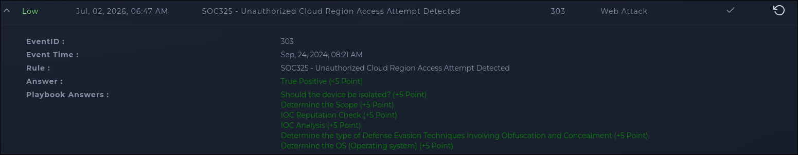

# INV-004: VPN Login Attempt from Unauthorized Country, Blocked by MFA

| | |
|---|---|
| **Platform** | LetsDefend |
| **Category** | Unauthorized Access |
| **Severity** | Low |
| **Verdict** | True Positive |

## Executive Summary

SIEM rule SOC257 flagged a VPN login attempt against `monica@letsdefend.io` from 113.161.158.12, an IP geolocated outside the company's authorized access list. The IP checks out as malicious on reputation lookup. The repeated MFA prompts suggest the attacker had access to at least the account identifier and may also have possessed valid credentials. The available evidence doesn't confirm how those credentials were obtained. No device access, no sensitive data exposure, no critical system impact. Verdict is True Positive: the attempt happened and used a real account identifier, it just didn't get past MFA.

## Alert Information

| Field | Value |
|-------|-------|
| Alert ID | SOC257 (Event ID 225) |
| Detection Rule | SOC257, VPN Connection Detected from Unauthorized Country |
| Source IP | 113.161.158.12 |
| Targeted Account | monica@letsdefend.io |
| VPN Gateway | https://vpn-letsdefend.io |
| Alert Trigger Reason | VPN login attempt from a country outside the authorized access list |

## Investigation

The alert itself is a geolocation trip-wire: a VPN login attempt reached the gateway from a country outside where the org expects its people to be connecting from. That alone is a reason to look, not a reason to close the case either way. First step was reputation on 113.161.158.12, which came back malicious. Second step was figuring out whether this was a random scan hitting the VPN endpoint or a targeted attempt against a real account, and it was the latter: the login was tied to Monica's actual username, not a guess against a nonexistent one.

Email analysis showed multiple MFA OTP requests sent to the account around the time of the alert. Combined with the use of a valid username, this points to an MFA bombing attempt. The available evidence indicates the attacker may have had valid credentials, but it doesn't show how they were obtained. The attacker appears to have been trying to get Monica to approve the authentication request. The login never completed, and MFA prevented access.

Checked whether the device needed isolating, whether sensitive data was at risk, and whether a critical system was touched. All three came back no, since the attacker never got past authentication. What I didn't do here was attempt to attribute this to a specific threat actor or campaign, the playbook step for that was left unanswered. Given the IP's reputation and the credential-targeting pattern, this reads as opportunistic use of a leaked or reused credential rather than a targeted campaign, but that's an inference, not a confirmed finding. No breach occurred, but the attack itself was real.

## IOC Table

| Type | Value | Description |
|------|-------|--------------|
| IP | 113.161.158.12 | Source of the unauthorized VPN login attempt |
| Username | monica@letsdefend.io | Targeted account |
| URL | https://vpn-letsdefend.io | Corporate VPN gateway targeted |

## Threat Intelligence

| Indicator | Checked Via | Result |
|-----------|-------------|--------|
| 113.161.158.12 | AbuseIPDB | Reported 4,661 times by 912 distinct sources; registered to a Vietnam-based telecom provider (VNPT); reports go back to January 2024 |

## MITRE ATT&CK Mapping

| Tactic | Technique | Evidence |
|--------|-----------|----------|
| Credential Access | T1110, Brute Force | Login attempted from a reputation-flagged external IP using a real account identifier |
| Credential Access | T1621, Multi-Factor Authentication Request Generation | Multiple MFA OTP prompts sent to the account in a short window |
| Credential Access | T1111, Multi-Factor Authentication Interception | Authentication attempt stalled at the MFA step, indicating the goal was to get past it |

## Impact & Verdict

No device access, no data exposure, no critical system impact. The attempt used a real, valid username against the corporate VPN from a reputation-flagged external IP and generated repeated MFA prompts before failing at that step. Threat actor attribution wasn't attempted in this case, so I can't speak to who's behind it or whether this account has been targeted before. Verdict is True Positive, high confidence. A malicious-reputation IP hitting a real account with an MFA bombing pattern isn't a false alarm, MFA is what stopped it from becoming one.

## Recommended Response

- **Containment:** No device isolation needed; attacker never obtained access
- **Eradication:** Block 113.161.158.12 at the VPN gateway/firewall
- **Recovery:** Force a password reset for Monica's account; reset the MFA seed if possible; invalidate any active sessions
- **Prevention:** Check for credential reuse across other services tied to this account; consider geo-restriction enforcement at the VPN gateway in addition to alerting

## Lessons Learned

MFA is the reason this stayed a Low-severity, no-impact incident instead of an account takeover. That's worth stating plainly since it's easy to treat MFA as a checkbox rather than the control that actually did the work here. Also worth flagging for process: the playbook's threat actor attribution step wasn't completed in this case. Given the account had a valid credential ready to use, following up on where that credential leaked from (this account or a related service) would close a gap this investigation left open.

## Evidence

### Alert Overview

*Figure 1: LetsDefend alert overview showing the alert details, completed playbook, and final True Positive verdict.*
